# PUC RIO - Pós Engenharia de Software 
- ## MVP Gestão Ágil de Projetos e Produtos 

# MVP
- Para acesso ao canvas do mvp [clique aqui](https://miro.com/app/board/uXjVLEEYgmk=/?share_link_id=409085500565) .
### 1 - Visão de Produto
- **Para**: O Sistema de Gestão de Funcionários
- **Cujo**: Gerencia o cadastro de Funcionários
- **O**: Sistema de Gestão de Funcionários, é uma: aplicação de gerenciamento para recursos humanos
 - **Que**: Simplifica e integra facilmente um novo funcionário ao sistema
 - **Diferente de**: O Sistema de Gestão de Funcionários XPTO,
 - **Nosso produto**: É mais intuitivo e tem campos customizaveis

 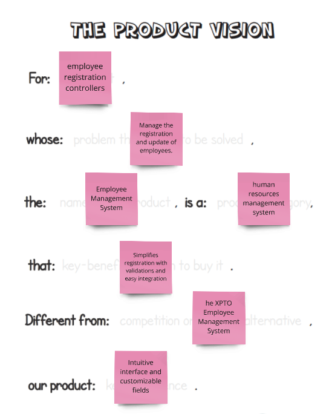

---
### 2 - É / Não é / Faz / Não Faz
- **É**:
    - Aplicativo Web
    - Interface amigável
    - Ferramenta de gestão de funcionários
    - Solução baseada em nuvem

    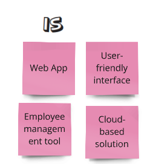

- **Não É**:
    - Plataforma de Mídias Sociais
    - Um sistema de folha de pagamento
    - Um aplicativo de desktop independente

    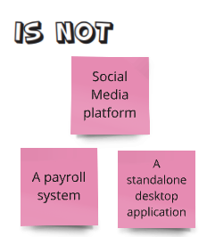

- **Faz**:
    - Agiliza o registro de funcionários
    - Fornece análise de dados para RH
    - Facilita a gestão de departamentos
    - Garante conformidade com regulamentações trabalhistas

    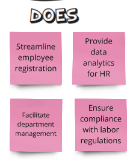

- **Não Faz**:
    - Substitui pessoal de recursos humanos
    - Lida com processamento de folha de pagamento
    - Oferece recursos de rede social
    - Garante decisões automáticas de contratação

    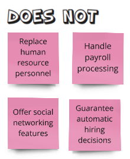

### 3 - Objetivo do Produto
- Melhorar a Eficiência
- Aumentar a Precisão dos Dados
- Facilitar a Conformidade
- Aumentar a Colaboração
- Reduzir Erros
- Melhorar a Segurança
- Apoiar a Escalabilidade
- Integrar com Sistemas Existentes

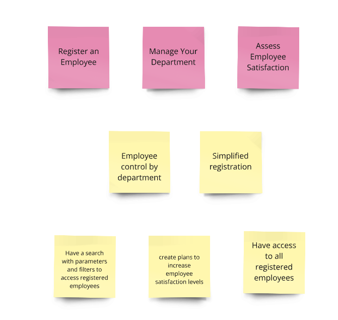

### 4 - Personas
- A pessoa

2 - Uma empresa que deseja 
- Ter um melhor controle sobre a gestão de seus funcionários. 
- Aumentar a produtividade e eficiência da empresa. 
- Melhorar a qualidade geral das operações da empresa. 

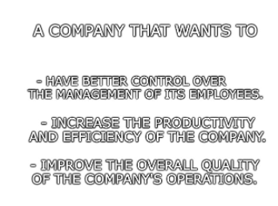

3 - Comportamento 
- Crescimento da Equipe 
- Ineficiência nos Processos 
- Necessidade de Conformidade 
- Dificuldade em Acessar Informações 
- Aumento das Demandas de Relatórios 

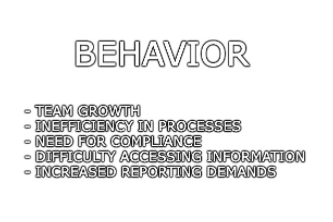

3 - Necessidades 
- Gestão Eficiente de Funcionários 
- Precisão dos Dados 
- Conformidade 
- Melhoria na Colaboração 
- Redução de Erros 
- Aumento da Segurança 
- Escalabilidade

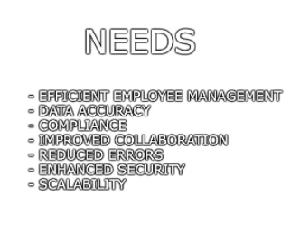

### 5 - Jornadas dos Usuários
- Chegar à Empresa
- Receber um Novo Funcionário
- Precisar Registrá-lo
- Usar o Sistema
- Verificar as Informações
- Precisar Encontrar Este Funcionário Depois
- Atualizar Suas Informações
- Verificar Sua Satisfação
- Fazer Ajustes Conforme Necessário

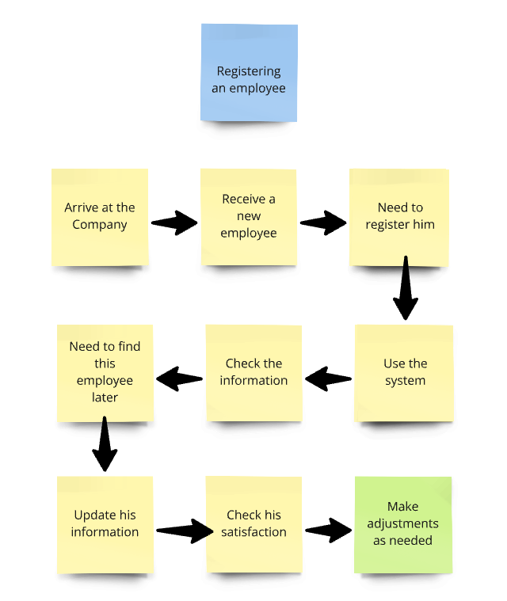

### 6 - Brainstorming de Funcionalidades
- Formulário de Registro de Funcionário
- Primeiro Nome
- Último Nome
- Data de Nascimento
- Email
- Número de Telefone
- Endereço
- Departamento
- Formulário de Registro de Departamento
- Nome do departamento
- Nível de satisfação
- Pesquisa Automática de CEP

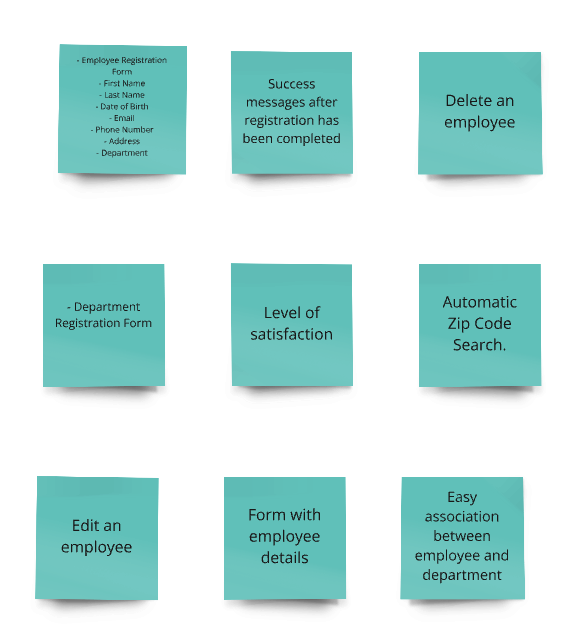

### 7 - Review da Experiência e Negócio Técnico do Usuário
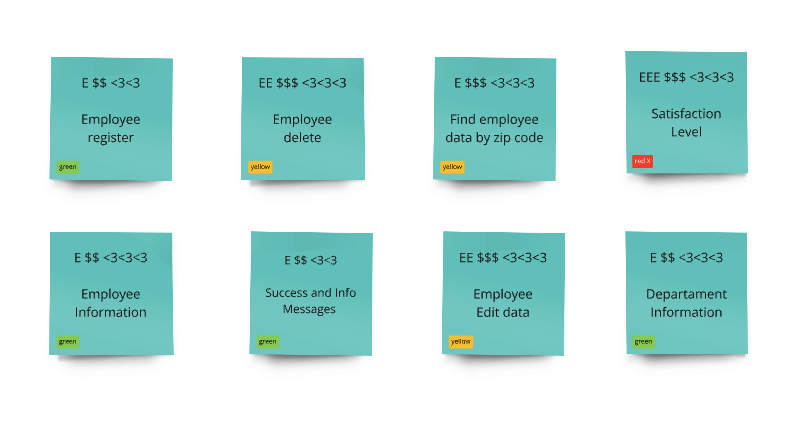

### 8 - Sequência
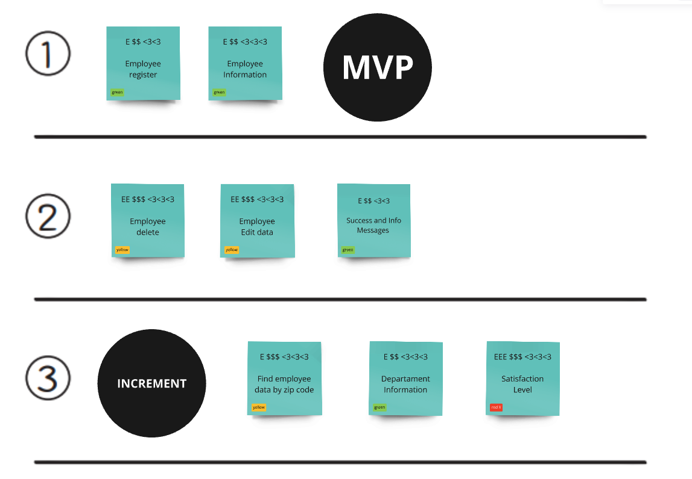

### 9 - MVP  Canvas
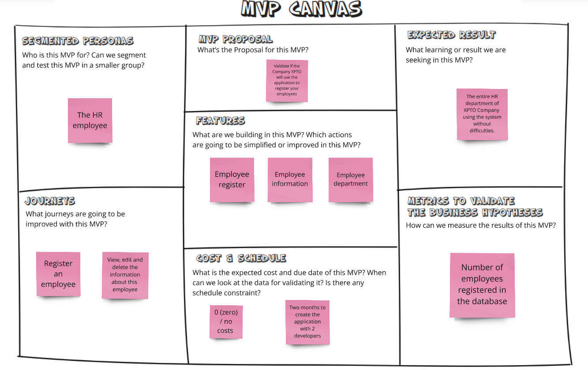

# Product Backlog
- Para acesso ao Épico [clique aqui](https://angeloakm.atlassian.net/browse/MGA-1)

### Controle de backlog no Jira
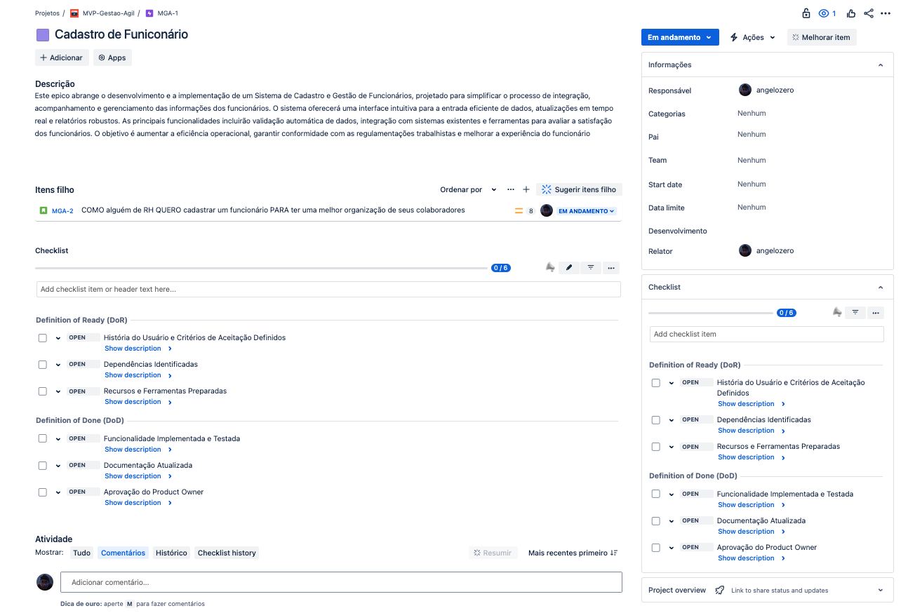

### Backlog com um requisito não funcional
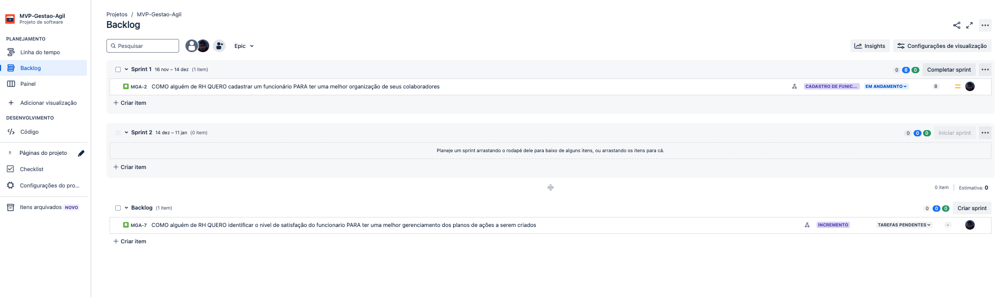

# Sprint Backlog
- Para acesso a Historia ativa na Sprint 1 [clique aqui](https://angeloakm.atlassian.net/browse/MGA-2)

### Historia com:
- DoD
- DoR
- Subtarefas
- Pontos da História

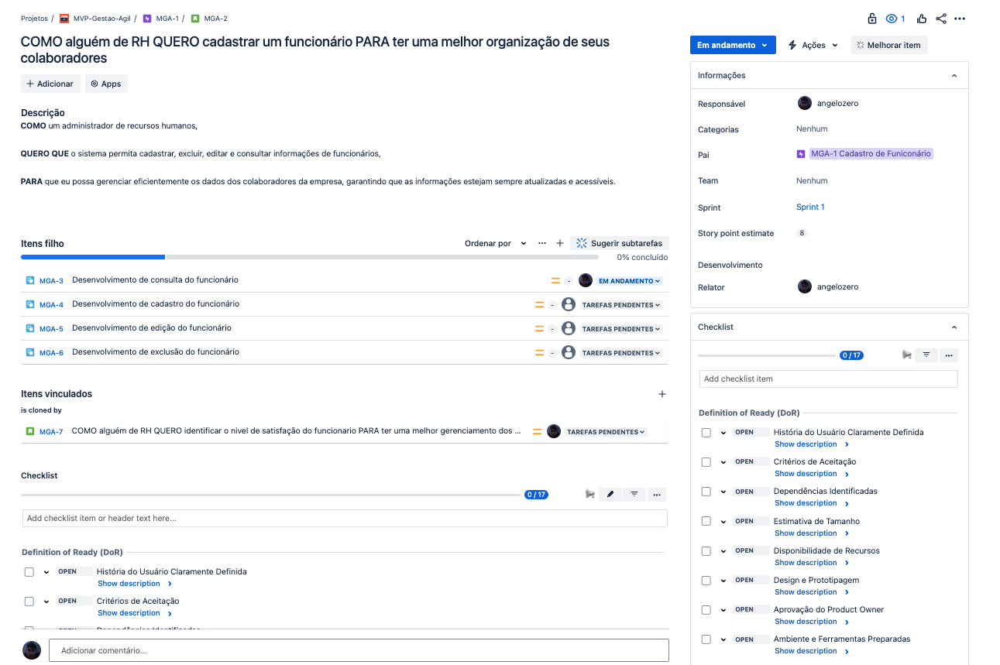

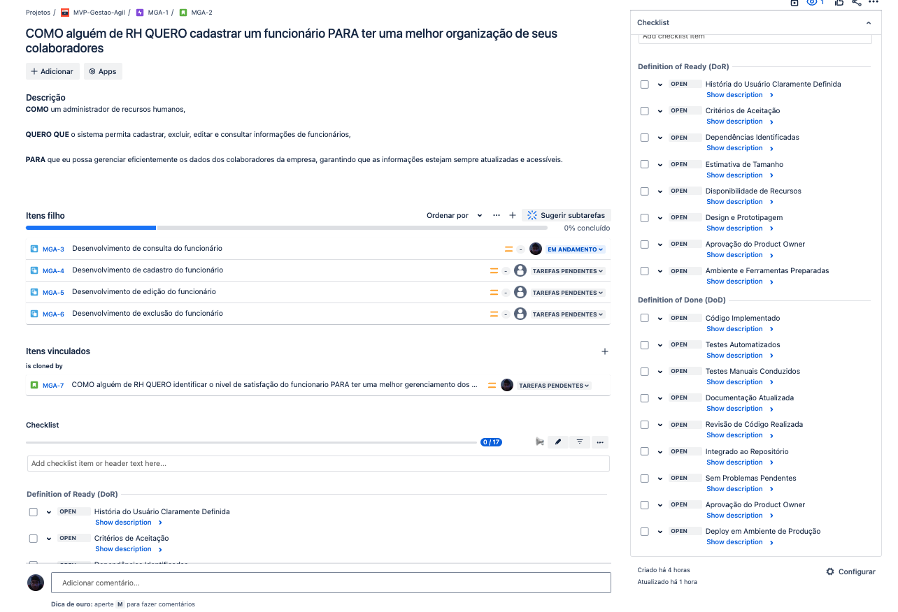

### Painel da Sprint
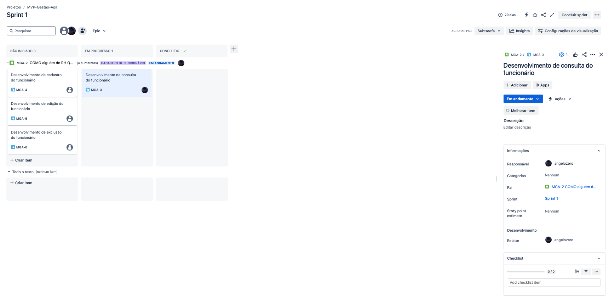

---

- Links Úteis 

| **Nome** | **Link** | 
| -------- | -------- |
| Projeto Backend | https://github.com/angelozero/backend |
| Projeto Frontend | https://github.com/angelozero/frontend |
| Backlog do Produto | https://angeloakm.atlassian.net/jira/software/projects/MGA/boards/6/backlog |
| Backlog do Sprint | https://angeloakm.atlassian.net/jira/software/projects/MGA/boards/6?selectedIssue=MGA-3 |
| MVP Canvas | https://miro.com/app/board/uXjVLEEYgmk=/?share_link_id=409085500565 |
| Wireframe Figma | https://www.figma.com/proto/KtZmxJkruUpUfThsa0fSkc/MVP---Gest%C3%A3o---%C3%81gil---Cadastro-de-Funcion%C3%A1rios?node-id=1-7&t=ETOwNoNIE0vJQzLL-1 |
| Video | https://youtu.be/FfTcrq2YPsQ |
